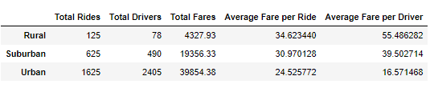
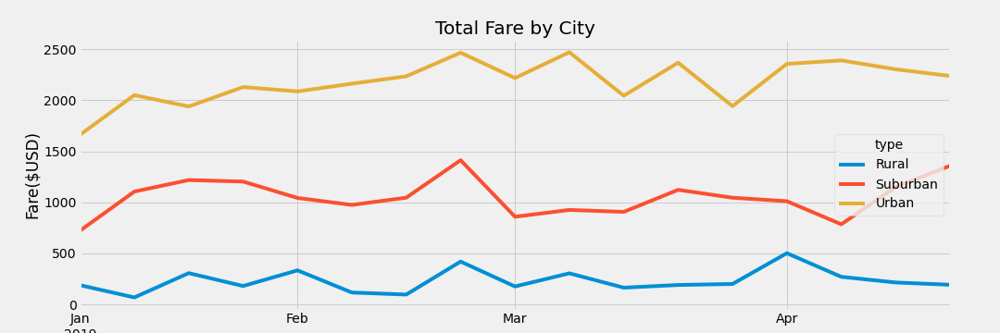

# PyBer_Analysis

## Overview of Project
 
The purpose of this project is to use python and pandas to create a summary DataFrame of ride sharing data by city type (Rural, Urban and Suburban). Finally, matplotlib is used to create a multiple-line graph that shows the total weekly fares for each city type.

### Results

Below is an insight of the PyBer analysis results.

- As per the DataFrame above, we notice that urban cities have the highest total rides, total drivers and total fares. However, they also have the lowest average fare per a ride as well as average fare per driver.
- Suburn cities came in second and then rural came in first despite having the lowest total rides, total drivers as well as total fares. Rural had the highest  average fare per ride and average fare per driver. 

The multiple line chart above visualizes the total fare for each city type. We can observe that the third week of February saw a hike in fares for all the cities which indicates high demand. There were some inconsistencies in March for the urban cities as the fares went up and down throughout the month.

### Summary

After analyzing all the data, we can conclude that while urban cities have the most revenue, more needs to be done to ensure steady profits. On the other side, rural cities are doing well and more investment in the area may have a positive return in future.

PyBer may consider lowering the prices in Suburban cities to increase market share which may inturn attract more business.

